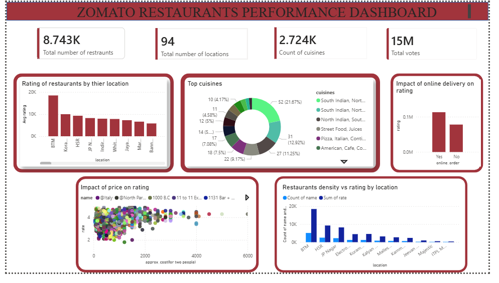

# 🍽️ Zomato Restaurant Data Analysis

## 📌 Overview

This project presents an end-to-end data analysis of Zomato restaurant data to uncover insights related to location trends, customer preferences, pricing, and service features. The goal is to support data-driven decision-making for restaurant businesses.

---

## 🛠️ Tools & Technologies

* **Python** – Data cleaning and preprocessing
* **SQL** – Data analysis and querying
* **Power BI** – Dashboard and visualization

---

## 📊 Key Analysis Performed

* Location-wise restaurant distribution
* Most popular cuisines
* Rating analysis by location
* Impact of online ordering & table booking
* Cost vs rating relationship
* Identification of high-density low-rating areas

---

## 🔍 Key Insights

* High restaurant concentration in locations like **BTM & Koramangala**
* **Online ordering and table booking** positively impact ratings
* Higher cost restaurants generally have better ratings
* Casual dining and cafes dominate the market
* Certain locations show **high competition but lower ratings** (improvement areas)

---

## 📈 Dashboard

---

## 🚀 Conclusion

The analysis highlights how pricing, location, and service features influence restaurant performance. These insights can help businesses improve customer experience and make strategic decisions.

---

## 📎 Note

Due to file size limitations, the original dataset is not uploaded.

